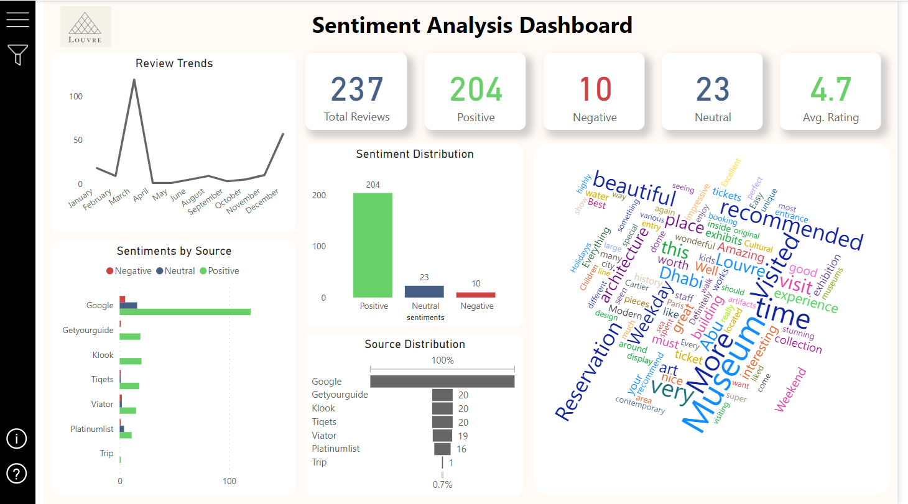
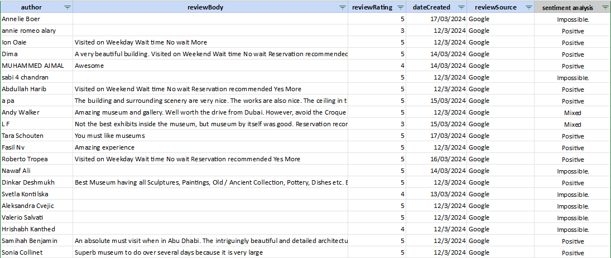

# Paris Louvre Museum - Sentiment Analysis Dashboard

This project showcases a **Power BI dashboard** analyzing customer reviews for the Louvre Museum. The dashboard provides insights into the sentiment of the reviews, distribution of review sources, and key trends.

---

## 📝 **Project Description**

This project aims to provide a comprehensive analysis of visitor feedback for the Louvre Museum using Power BI. By aggregating reviews from various sources such as Google, GetYourGuide, and Klook, the dashboard offers insights into visitor satisfaction, common themes, and areas of improvement.

The **sentiment analysis** helps identify what visitors love about the museum and any recurring issues. This information can assist museum management in improving visitor experiences and optimizing operations, such as wait times, reservation systems, and exhibit planning.

---

## 📊 **Dashboard Overview**

### Sentiment Analysis Dashboard

### Key Metrics:
- **Total Reviews**: 237
- **Positive Reviews**: 204
- **Negative Reviews**: 10
- **Neutral Reviews**: 23
- **Average Rating**: 4.7

### Visualizations Included:
1. **Review Trends** (over the months)
2. **Sentiment Distribution** (Positive, Neutral, Negative)
3. **Sentiments by Source** (Google, GetYourGuide, Klook, etc.)
4. **Source Distribution** (Share of reviews by platform)
5. **Word Cloud** (Frequent words in positive reviews)

---

## 📈 **Insights**

### Key Takeaways

1. **Dominantly Positive Sentiment**:
   - Out of 237 total reviews, **204** are positive (86%), reflecting a high satisfaction rate among visitors.

2. **Review Trends**:
   - A significant spike in reviews occurred in **April**, which may correlate with increased tourism during holidays or special events.
   - The number of reviews tends to drop in the summer months, potentially indicating lower visitor turnout during that period.

3. **Sentiment Sources**:
   - **Google** is the primary source of reviews, contributing the majority of positive sentiments.
   - Other sources like **GetYourGuide**, **Klook**, and **Tiqets** also show positive feedback, but in smaller volumes.

4. **Common Themes**:
   - The **Word Cloud** highlights words such as **"beautiful," "recommended," "museum," and "time"**, indicating that visitors appreciate the museum's exhibits, architecture, and overall experience.

5. **Negative Sentiments**:
   - Only **10 reviews** are negative. Issues mentioned include **weather conditions, wait times**, and **reservation processes**.

---

## 📂 **Dataset**

### Sample Dataset

The dataset includes:
- **Author** of the review
- **Review Body** (text)
- **Review Rating** (1-5)
- **Date Created**
- **Review Source** (e.g., Google)
- **Sentiment Analysis** (Positive, Neutral, Negative)

---

## 🚀 **Features**

- **Sentiment Analysis**: Visualizes positive, negative, and neutral reviews.
- **Trends and Insights**: Displays monthly review trends.
- **Source Analysis**: Tracks reviews by different platforms.
- **Interactive Visuals**: Drill-down capability in Power BI.

---

## 🛠️ **Tools Used**

- **Power BI**: For dashboard creation and data visualization.
- **Excel**: For storing and preparing the dataset.
- **DAX**: For calculations in Power BI.

---

## 📫 **Contact**

- **LinkedIn**: [Your LinkedIn Profile](#)
- **Email**: [Your Email](mailto:youremail@example.com)

